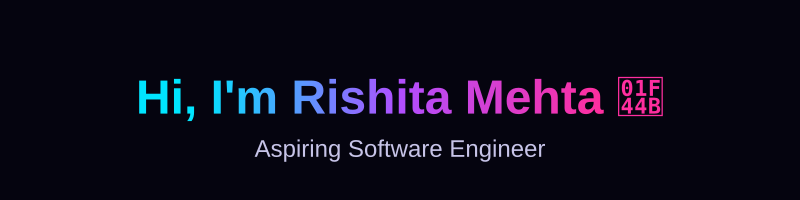

 

<table align="center" width="100%" style="border: none;">
  <tr>
    <td width="50%" valign="top">
      <h2>👋 Hi there, I'm Rishita!</h2>
      <b>🎓 Education:</b> Final Year B.Tech CSE @ VIT Bhopal University (CGPA: 8.81/10) 
      <b>💼 Role:</b> Aspiring Software Engineer 
      <b>💡 Interests:</b> Scalable Systems, Problem Solving, Open Source, Modern Web Tech 
      <b>🌱 Learning:</b> System Design, Generative AI, Cloud Computing 
       
      <blockquote>
<i>"Building technology that solves real-world problems."</i>
</blockquote>
    </td>
    <td width="50%" valign="top">
      <h3>🚀 Specialization</h3>
      
      
      
      
        
      <h3>🏆 Key Achievements</h3>
      
       
      
       
      
       
      
    </td>
  </tr>
</table>

## Featured Projects

<table width="100%">
<tr>
<td width="50%" valign="top">

**[Smart Flow — Traffic Management](https://github.com/Mehtarishita/SmartFlow-Traffic-System)**
`Published Patent`

AI-powered computer vision system for dynamic lane prioritization and intelligent traffic management.

</td>
<td width="50%" valign="top">

**[Vasudha — Digital Farm Management](https://github.com/Mehtarishita/Vasudha)**
`SIH 2025 — National Runner-Up`

AI + Blockchain platform for antimicrobial monitoring, traceability, and livestock health tracking.

</td>
</tr>
<tr>
<td width="50%" valign="top">

**[SamvidhanPath](https://github.com/Mehtarishita/Samvidhan-Path)**

Full stack constitutional learning platform making civic education interactive through quizzes and personalized learning paths.

</td>
<td width="50%" valign="top">

**[Station Guide](https://github.com/Mehtarishita/StationGuide)**

Smart railway navigation platform built for Smart India Hackathon to improve passenger accessibility.

</td>
</tr>
<tr>
<td width="50%" valign="top">

**[StyleMeUp](https://github.com/Mehtarishita/StyleMeUp)**
`Work in Progress · Dream Project`

AI-powered fashion styling platform delivering personalized outfit recommendations based on user preferences and fashion trends — combining modern UI/UX with intelligent recommendation workflows for an engaging virtual styling experience.

</td>
<td width="50%" valign="top">

&nbsp;

</td>
</tr>
</table>

## Tech Stack

 

  

**AI / ML**
 

**CS Fundamentals**
 
`Data Structures` · `Algorithms` · `DBMS` · `Operating Systems` · `Computer Networks` · `OOP`

## Impact

- **Smart India Hackathon 2025 National Runner-Up**, ranked among 1000+ competing teams
- **Published an Indian Patent** for an AI-driven Intelligent Traffic Management System
- Built multiple full-stack applications addressing real-world government and societal problems
- Actively developing expertise in AI, backend engineering, and scalable software systems
- Open-source contributor through **GirlScript Summer of Code**

## Beyond Code

 

 

 

### Today's Thought

> *"The best way to predict the future is to build it."*
> **— Alan Kay**

## GitHub Stats

## 3D Contribution Calendar

Rebuilds nightly via the <code>3d-contrib.yml</code> workflow — an isometric, animated read of your real commit history.

## Contribution Snake

<picture>
  <source media="(prefers-color-scheme: dark)" srcset="https://raw.githubusercontent.com/Mehtarishita/Mehtarishita/output/snake-dark.svg" />
  
</picture>

## Let's Connect

*Portfolio — coming soon*

 

